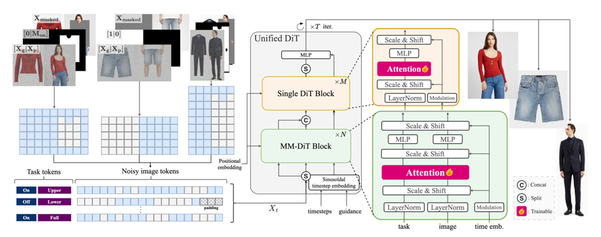

## Voost: A Unified and Scalable Diffusion Transformer for Bidirectional Virtual Try-On and Try-Off

Unofficial paper implementation of Voost paper - Virtual try-on & try-off


## Architecture




## Features

- MM-DiT block
- Single DiT block

## Citation

Official paper:

```
@article{lee2025voost,
  author  =   {Seungyong Lee and Jeong-gi Kwak},
  title   =   {Voost: A Unified and Scalable Diffusion Transformer for Bidirectional Virtual Try-On and Try-Off},
  journal =   {arXiv preprint arXiv:2508.04825},
  year    =   {2025}
}
```